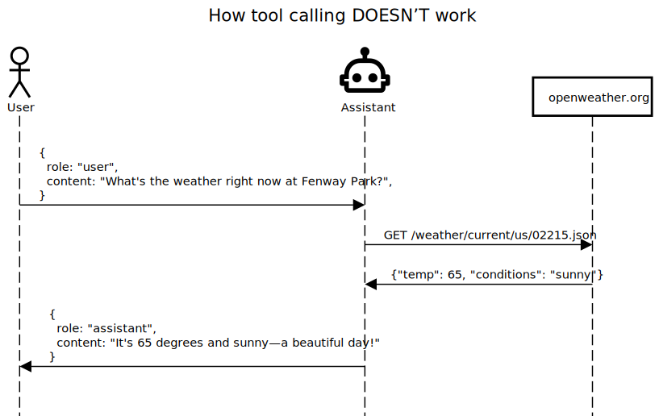
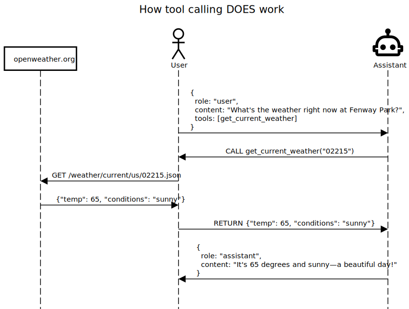

```{r}
#| include: false
knitr::opts_chunk$set(
  collapse = TRUE,
  comment = "#>",
  eval = ellmer:::eval_vignette()
)
vcr::setup_knitr()
```

## Introduction

One of the most interesting aspects of modern chat models is their ability to make use of external tools that are defined by the caller.

When making a chat request to the chat model, the caller advertises one or more tools (defined by their function name, description, and a list of expected arguments), and the chat model can choose to respond with one or more "tool calls". These tool calls are requests *from the chat model to the caller* to execute the function with the given arguments; the caller is expected to execute the functions and "return" the results by submitting another chat request with the conversation so far, plus the results. The chat model can then use those results in formulating its response, or, it may decide to make additional tool calls.

*Note that the chat model does not directly execute any external tools!* It only makes requests for the caller to execute them. It's easy to think that tool calling might work like this:



But in fact it works like this:



The value that the chat model brings is not in helping with execution, but with knowing when it makes sense to call a tool, what values to pass as arguments, and how to use the results in formulating its response.

```{r setup}
library(ellmer)
```


### Motivating example

Let's take a look at an example where we really need an external tool. Chat models generally do not know the current time, which makes questions like these impossible.

```{r}
#| label: no-tool
#| cassette: true

chat <- chat_openai(model = "gpt-4o")
chat$chat("How long ago did Neil Armstrong touch down on the moon?")
```

Since the model doesn't know what day it is, the result is incorrect.

### Defining a tool function

The first thing we'll do is define an R function that returns the current time.

```{r}
#' Gets the current time in the given time zone.
#'
#' @param tz The time zone to get the current time in.
#' @return The current time in the given time zone.
get_current_time <- function(tz = "UTC") {
  format(Sys.time(), tz = tz, usetz = TRUE)
}
```

Note that we've gone through the trouble of creating [roxygen2 comments](https://roxygen2.r-lib.org/). This isn't necessary, but as we'll see shortly, can make it a bit easier to generate a tool defintion.

```{r}
#| include: false

# Fake it for the vignette so we always get the same results
get_current_time <- function(tz = "UTC") {
  format(
    as.POSIXct("2025-06-25 11:53:23", tz = "America/Chicago"),
    tz = tz,
    usetz = TRUE
  )
}
```

To turn a function into a tool, we provide some additional metadata that the model will use:

```{r}
get_current_time <- tool(
  get_current_time,
  name = "get_current_time",
  description = "Returns the current time.",
  arguments = list(
    tz = type_string(
      "Time zone to display the current time in. Defaults to `\"UTC\"`.",
      required = FALSE
    )
  )
)
```

This is a fair amount of code to write, even for such a simple function. Fortunately, you don't have to write this by hand! I generated the above `tool()` call by calling `create_tool_def(get_current_time)`, which uses an LLM to generate the `tool()` call for you. `create_tool_def()` is not perfect, so you must review the generated code before using it, but it is a big time-saver.

Note that a tool is just a special type of function so we can still call it:

```{r}
get_current_time()
```

### Registering and using tools

Now we need to give our chat object access to our tool. We do this with `$register_tool()`:

```{r}
chat$register_tool(get_current_time)
```

That's all we need to do! Let's retry our query:

```{r}
#| label: with-tool
#| cassette: true

chat$chat("How long ago did Neil Armstrong touch down on the moon?")
```

That's correct! Without any further guidance, the chat model decided to call our tool function and successfully used its result in formulating its response.

If we print the chat we can see where the model decided to use the tool:

```{r}
chat
```

(Full disclosure: I originally tried this example with the default model of `gpt-4o-mini` and it got the tool calling right but the date math wrong, hence the explicit `model="gpt-4o"`.)

This tool example was extremely simple, but you can imagine doing much more interesting things from tool functions: calling APIs, reading from or writing to a database, kicking off a complex simulation, or even calling a complementary GenAI model (like an image generator). Or if you are using ellmer in a Shiny app, you could use tools to set reactive values, setting off a chain of reactive updates.

### Tool inputs and outputs

Remember that tool arguments come from the LLM, and tool results are returned to the LLM. This implies that you should keep both as simple as possible.

Inputs to a tool call, must be defined by `type_boolean()`, `type_integer()`, `type_number()`, `type_string()`, `type_enum()`, `type_array()`, or `type_object()`. We recommend keeping them as simple as possible, focusing on basic scalar types as much as you can.

The output of the tool call will be interpreted by the LLM, just as if you had typed that information into the data. That means you'll generally want to produce text or other atomic vectors. For more complex data, ellmer will automatically serialize the result to JSON, which LLMs generally seem to be good at understanding.  If you must have more direct control of the structure of the JSON that's returned, you can return a JSON-serializable value wrapped in `I()`, which ellmer will leave alone until the entire request is JSON-serialized.

To show off these ideas, here's a slightly more complicated example simulating a weather API that returns data for multiple cities at once. The `get_weather()` function returns a data frame that ellmer will automatically convert into JSON in row-major format, which our experiments suggest is good for LLMs.

```{r}
get_weather <- tool(
  function(cities) {
    raining <- c(London = "heavy", Houston = "none", Chicago = "overcast")
    temperature <- c(London = "cool", Houston = "hot", Chicago = "warm")
    wind <- c(London = "strong", Houston = "weak", Chicago = "strong")

    data.frame(
      city = cities,
      raining = unname(raining[cities]),
      temperature = unname(temperature[cities]),
      wind = unname(wind[cities])
    )
  },
  name = "get_weather",
  description = "
    Report on weather conditions in multiple cities. For efficiency, request
    all weather updates using a single tool call
  ",
  arguments = list(
    cities = type_array(type_string(), "City names")
  )
)
```

Now we register and use it:

```{r}
#| label: inputs-outputs
#| cassette: true

chat <- chat_openai()
chat$register_tool(get_weather)
chat$chat("Give me a weather update for London and Chicago")
```

We can print the chat to confirm that the model only performed a single tool call:

```{r}
chat
```

### Image and PDF tool output

ellmer allow tools to return image or PDF content that can be returned with the tool result, if the LLM or API supports vision capabilities.

Simply return a `content_image_file()`, `content_pdf_file()`, or similar content type from the tool function.
For example, here's a simple tool to screenshot a website:

```{r}
#| eval: false

screenshot_website <- tool(
  function(url) {
    tmpf <- withr::local_tempfile(fileext = ".png")
    webshot2::webshot(url, file = tmpf)
    content_image_file(tmpf)
  },
  name = "screenshot_website",
  description = "Take a screenshot of a website.",
  arguments = list(
    url = type_string("The URL of the website")
  )
)
```

You could use this tool to allow the LLM to "see" websites, like [the tidyverse website](https://tidyverse.org):

```{r}
#| eval: false

chat <- chat_openai()
#> Using model = "gpt-4.1".
chat$register_tool(screenshot_website)
chat$chat("Describe the design aesthetic of https://tidyverse.org")
#> https://tidyverse.org screenshot completed
#> The design aesthetic of the Tidyverse website (https://tidyverse.org) is
#> clean, modern, and minimalistic, with several distinct features:
#>
#> - **Color Palette**: The overall site uses a lot of white space with navy
#>   and dark backgrounds for some elements, accentuated by the colorful
#>   hexagonal logos for various R packages.
#> - **Typography**: Simple, sans-serif fonts contribute to readability and
#>   a contemporary look.
#> - **Hexagonal Icons**: Prominent display of tidyverse package logos in
#>   hexagonal shapes, emphasizing the modular, package-oriented
#>   nature of the Tidyverse.
#> - **Layout**: A balanced, spacious two-column layout. The left side
#>   features graphic elements; the right side provides concise, text-based
#>   information.
#>
#> Overall, the design communicates clarity, ease of use, and a focus on
#> modern data science tools.
```

### Tool context

Tools can access private, per-conversation state and per-call metadata without exposing them to the model. Inside a tool body, `tool_context()` returns a context object with three fields: `$request` (the `ContentToolRequest` for this call), `$store` (the chat's shared store), and `$turns` (a snapshot of the conversation history up to this point). The store is an ordinary R environment, so mutations are by reference and persist across `$chat()` calls for the lifetime of the chat object. `ctx$store` and `chat$store` are the same object.

Here is a simple counter that tracks how many times it has been called:

```{r}
#| label: tool-context
#| cassette: true

counter_tool <- tool(
  function() {
    ctx <- tool_context()

    # Read the tool request
    id <- ctx$request@id
    id <- substr(id, nchar(id) - 8, nchar(id))
    cli::cli_alert_info("Counter called (id: ...{id})")

    # Update the chat store
    ctx$store$n <- (ctx$store$n %||% 0L) + 1L
    ctx$store$n
  },
  description = "Increment and return the call counter.",
  arguments = list()
)

chat <- chat_openai()
chat$register_tool(counter_tool)
chat$chat("Call the counter three times.")
chat$store$n   # 3; persists across $chat() calls
```

You can also pre-seed the store before chatting, or inspect it afterwards, via `chat$store`. This is a good place to keep credentials and per-user details that tools need but the model should never see, such as the user's email and an auth token:

```{r}
#| eval: false

chat$store$user_email <- "hadley@posit.co"
chat$store$auth_token <- "tok_simulated_4f3b2a1c"   # e.g. from your auth flow
```

A tool can then read these from `tool_context()$store` to act on the user's behalf without the token ever appearing in the conversation:

```{r}
#| eval: false

send_email_tool <- tool(
  function(subject, body) {
    ctx <- tool_context()
    send_email(
      to = ctx$store$user_email,
      token = ctx$store$auth_token,
      subject = subject,
      body = body
    )
    "Email sent."
  },
  description = "Send an email to the current user.",
  arguments = list(
    subject = type_string("The email subject."),
    body = type_string("The email body.")
  )
)
```

`chat$clone()` gives the clone its own independent copy of the store, so cloned chats don't interfere with each other.

**Async tools:** in an async tool, `tool_context()` is only valid during the synchronous prefix of the function — before the first `await()`. Capture it at the top of your tool body:

```{r}
#| eval: false

my_async_tool <- tool(
  coro::async(function() {
    ctx <- tool_context()   # capture before any await()
    result <- await(some_async_call())
    ctx$store$log <- c(ctx$store$log, result)  # safe: ctx$store is an env
    result
  }),
  description = "An async tool that logs its result.",
  arguments = list()
)
```

`tool_context()` will error with a clear message if called after an `await()` or outside a tool invocation. Built-in provider tools (such as `claude_tool_web_search()`) run provider-side and do not support `tool_context()`; MCP tools do.
